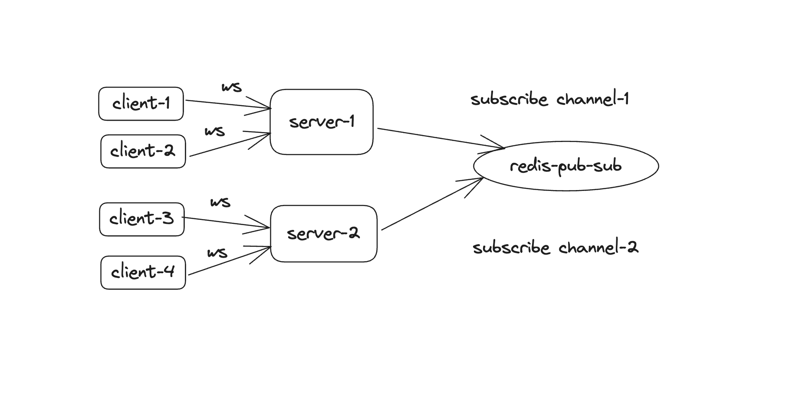
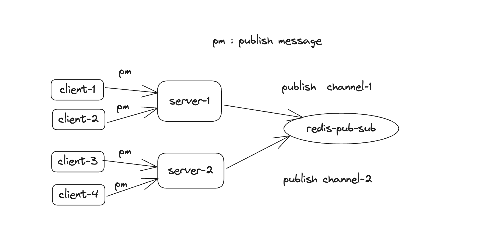
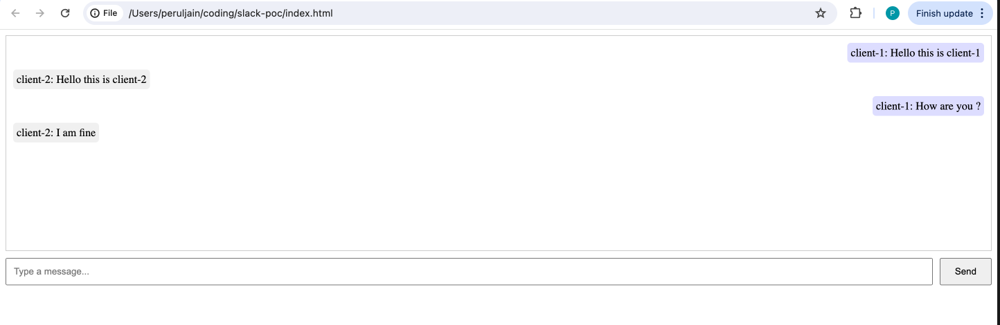
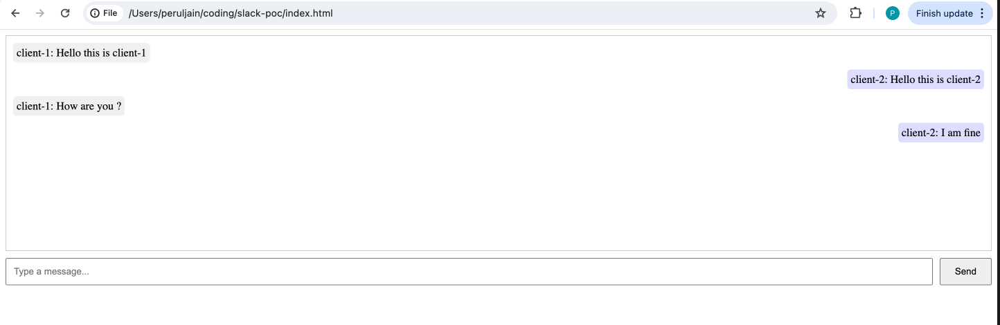

# Context
Created a prototype of slack for learning websockets and redis-pub-sub. 

## High Level Overview 

Client established connection with websocket servers

Client send message via http REST call and then server will publish message to redis-pub-sub

# steps to run

1. docker-compose up -d
2. go run web-socket.go
3. open index.html in browser

# Screenshots

Run server on port 8080 and 8081

Client-1

Client-2

